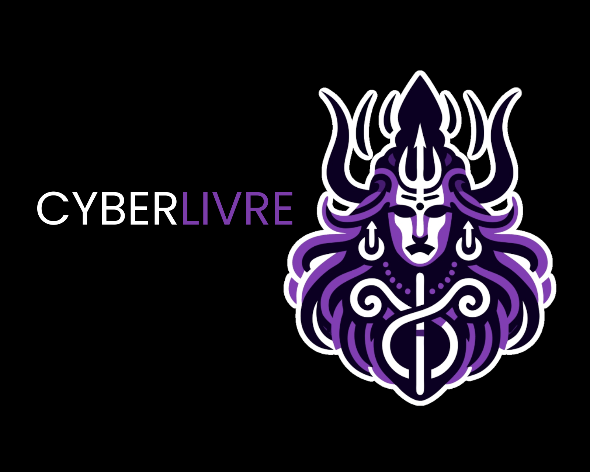

  

# Curso CyberLivre

> **Um curso completo e gratuito para formar profissionais em Segurança Cibernética**

Este projeto é um repositório inspirado no [Ciência da Computação](https://github.com/Universidade-Livre/ciencia-da-computacao) e consiste em um **curso completo para formar profissionais na área de segurança cibernética**, com conteúdo suficiente para você ingressar no mercado de trabalho e continuar se aprimorando cada vez mais.  

Utilizamos materiais diversos encontrados em **plataformas gratuitas**, o que permite aprender sem gastar nada. Acreditamos que o acesso à educação deve ser possível para todos.  

O conteúdo do curso pode ser feito **individualmente ou em grupo** — sinta-se livre para estudar no seu tempo e do jeito que achar melhor!  

Todos os cursos escolhidos aqui são conhecidos por sua **qualidade e fácil entendimento**. Este projeto será constantemente aprimorado ao longo do tempo.

Este curso não descarta a possibilidade de se aprofundar nos tópicos apresentados ainda mais, recomendamos que o faça.

Recomenda-se a criação de atividades e desafios sobre os topicos estudados para melhor entendimento.

**Bons estudos !!!**  

## 🗺️ **Estrutura do Curso**

| Nível | Foco | Duração Estimada | Status |
|-------|------|------------------|--------|
| [**0️⃣ Soft Skills**](#0️⃣-nível-0---soft-skills) | Comunicação, Liderança, Pensamento Crítico | 2-3 semanas | ✅ |
| [**1️⃣ Hardware**](#1️⃣-nível-1---hardware) | Fundamentos de Hardware e Arquitetura | 2-3 semanas | ✅ |
| [**2️⃣ Sistemas Operacionais**](#2️⃣-nível-2---sistemas-operacionais) | Windows, Linux, Virtualização | 4-6 semanas | ✅ |
| [**3️⃣ Redes**](#3️⃣-nível-3---redes-de-computadores) | TCP/IP, Protocolos, Infraestrutura | 6-8 semanas | ✅ |
| [**4️⃣ Programação**](#4️⃣-nível-4---programação) | Python, Automação, Scripting | 8-10 semanas | ✅ |
| [**5️⃣ Segurança Cibernética**](#5️⃣-nível-5---segurança-cibernética) | Red/Blue Team, SOC, Pentest | 12+ semanas | ✅ |

---

## **0️⃣ Nível 0 - Soft Skills**

**🎯 Objetivo:** Desenvolver habilidades interpessoais essenciais para o sucesso profissional.

Competências técnicas são fundamentais, mas soft skills fazem a diferença na carreira. Este nível desenvolve comunicação, liderança, pensamento crítico e inteligência emocional.

### 📺 Vídeos/Playlists

| Nº | Conteúdo | Canal | Descrição |
|----|----------|-------|-----------|
| 1 | [**Aulas de Filosofia**](https://youtube.com/playlist?list=PLhuwT6UtzNbnkUlRUZvY6DBgr9LInBtrZ&si=yg5hFpEGxui1FW8d) | Isto não é Filosofia | Pensamento crítico e análise lógica através da filosofia |
| 2 | [**Técnicas de Vendas e Negociação**](https://youtube.com/playlist?list=PL5lL7Dm426seGa5Hmi1jIu0p8OYtNs2Xm&si=5D_Xs-e81_ZzBsE7) | Profissional Marketing | Persuasão, negociação e fechamento de negócios |
| 3 | [**Apresentação de Slides**](https://youtube.com/playlist?list=PL6OEUipU7xC7vCVVaOFikOjVqf1BhTVR0&si=6vfhiXAG4Dtpy6Uv) | TechEnfim | Criação de apresentações impactantes |
| 4 | [**Comunicação e Oratória**](https://youtube.com/playlist?list=PLF0WnKFaIjV2s2-vU2up7-cqpOACSx73v&si=KUKu_te4h9HpLadg) | El Professor da Oratória | Desenvolvimento da comunicação verbal |
| 5 | [**Networking Profissional**](https://youtu.be/jr8rv8JCcI0) | Jovens de Negócios | Construção de relacionamentos estratégicos |
| 6 | [**Construção da Identidade**](https://youtube.com/playlist?list=PLwinAdFkfTrVLsK1yBMkmf8SkTg-aR7r-&si=Jt1sK4TkqNiUvfDs) | Projeto Cão Pastor | Autoconhecimento e desenvolvimento pessoal |
| 7 | [**Performance e Foco**](https://youtube.com/playlist?list=PLwinAdFkfTrU2l2iQuvw6U-n2xTdDWUZZ&si=F3aBeV1A1paIN0Yl) | Projeto Cão Pastor | Disciplina e alta performance |
| 8 | [**Filosofia Aplicada**](https://youtube.com/playlist?list=PLN50oHosyDdg4P68_1pzRMqHpUnSfJGEF&si=JgmK4wbYFAS5ZxRT) | Clóvis de Barros Filho | Ética e reflexões práticas |

### 🎓 Cursos Estruturados

| Nº | Curso | Plataforma | Descrição |
|----|-------|------------|-----------|
| 1 | [**Vendas: Prospecção ao Fechamento**](https://kultivi.com/cursos/negocios/vendas-da-prospeccao-ao-fechamento) | Kultivi | Técnicas completas de vendas |
| 2 | [**Escrita Criativa**](https://kultivi.com/cursos/negocios/curso-escrita-criativa) | Kultivi | Melhore sua comunicação escrita |
| 3 | [**Networking Estratégico**](https://kultivi.com/cursos/negocios/conexoes-estrategicas-e-networking-intencional) | Kultivi | Relacionamentos profissionais eficazes |
| 4 | [**Gestão de Compras**](https://kultivi.com/cursos/negocios/compras-iniciando-uma-carreira-de-sucesso) | Kultivi | Negociação e gestão estratégica |
| 5 | [**Social Media Marketing**](https://kultivi.com/cursos/negocios/social-media) | Kultivi | Marketing digital e presença online |
| 6 | [**Oratória de Alta Performance**](https://kultivi.com/cursos/negocios/oratoria-de-alta-performance) | Kultivi | Técnicas avançadas de apresentação |
| 7 | [**Gestão de Tempo**](https://kultivi.com/cursos/negocios/gestao-de-tempo-e-produtividade) | Kultivi | Produtividade e organização |
| 8 | [**Marketing Digital Fundamentos**](https://kultivi.com/cursos/negocios/fundamentos-do-marketing-digital) | Kultivi | Base do marketing online |
| 9 | [**Empreendedorismo Social**](https://kultivi.com/cursos/negocios/empreendedorismo-e-impacto-social) | Kultivi | Negócios sustentáveis e impacto |

---

## **1️⃣ Nível 1 - Hardware**

**🎯 Objetivo:** Compreender a base física dos sistemas computacionais.

Entender hardware é fundamental para cibersegurança. Ataques podem explorar vulnerabilidades físicas, e a defesa eficaz requer conhecimento desde o nível mais básico.

### 📺 Vídeos/Playlists

| Nº | Conteúdo | Canal | Descrição |
|----|----------|-------|-----------|
| 1 | [**Curso Completo de Hardware**](https://youtube.com/playlist?list=PLHz_AreHm4dn1JHgN9wpbIUhzZmycYQXW&si=HXk6qU1LVVpoSujK) | Curso em Vídeo | Fundamentos estruturados de hardware |
| 2 | [**Hardware na Prática**](https://youtube.com/playlist?list=PL968TMGoACSuEiD44jNGIbvQfJo4Lwf3-&si=CxmgW2KRsyx-0opI) | MW Informática | Montagem, diagnóstico e manutenção |

### 🎓 Cursos Estruturados

| Nº | Curso | Plataforma | Descrição |
|----|-------|------------|-----------|
| 1 | [**Fundamentos de TI**](https://www.ev.org.br/cursos/fundamentos-de-ti-hardware-e-software) | Fundação Bradesco | Introdução ao hardware e software |
| 2 | [**Hardware Basics**](https://www.netacad.com/pt/courses/computer-hardware-basics?courseLang=pt-BR) | Cisco NetAcad | Componentes e arquitetura técnica |

---

## **2️⃣ Nível 2 - Sistemas Operacionais**

**🎯 Objetivo:** Dominar os sistemas que executam as aplicações e serviços.

Sistemas operacionais são o alicerce de qualquer infraestrutura. Em cibersegurança, você precisa saber como eles funcionam para protegê-los ou explorá-los eticamente.

### 📺 Vídeos/Playlists

| Nº | Conteúdo | Canal | Descrição |
|----|----------|-------|-----------|
| 1 | [**Windows Essencial**](https://youtu.be/-0KKHRXJfqU?si=lEK-MkGQ2k-35Ln_) | Daves Tecnologia | Fundamentos do Windows para profissionais |
| 2 | [**Linux para Iniciantes**](https://youtube.com/playlist?list=PLZsjaJhVZaxX9xCXhZDJnhFcIL4ncLjVj&si=Uot1X0wADAw5xWyu) | Diolinux | Comandos básicos e terminal |
| 3 | [**Linux Intermediário**](https://youtube.com/playlist?list=PLucm8g_ezqNp92MmkF9p_cj4yhT-fCTl7&si=cJVOXjCwN5pJKQal) | Bóson Treinamentos | Administração avançada |
| 4 | [**Windows Server**](https://youtube.com/playlist?list=PLqjSTsK75fSeuSEVCmiP5MkdcNBFRujge&si=eaen42jbeKYQZVk7) | Julio Battisti | Instalação e gerenciamento |
| 5 | [**Virtualização**](https://youtube.com/playlist?list=PLAp37wMSBouCqJnY-Qck_XDwplEud3ELc&si=8mSVEBrGATNL0oJX) | Hardware Redes Brasil | VMs e containers |
| 6 | [**Docker na Prática**](https://youtube.com/playlist?list=PLViOsriojeLrdw5VByn96gphHFxqH3O_N&si=F3AW_41YoX416rPR) | TechEduca | Containerização de aplicações |

### 🎓 Cursos Estruturados

| Nº | Curso | Plataforma | Descrição |
|----|-------|------------|-----------|
| 1 | [**Operating Systems Basics**](https://www.netacad.com/pt/courses/operating-systems-basics?courseLang=en-US) | Cisco NetAcad | Fundamentos de sistemas operacionais |
| 2 | [**Linux Unhatched**](https://www.netacad.com/pt/courses/linux-unhatched?courseLang=pt-BR) | Cisco NetAcad | Primeira experiência com Linux |
| 3 | [**Fundamentos de Linux**](https://www.netacad.com/pt/courses/fundamentos-de-linux?courseLang=es-XL) | Cisco NetAcad | Administração essencial do Linux |
| 4 | [**Computer & Mobile Devices**](https://www.netacad.com/pt/courses/computer-mobile-devices?courseLang=en-US) | Cisco NetAcad | Dispositivos móveis e integração |

---

## **3️⃣ Nível 3 - Redes de Computadores**

**🎯 Objetivo:** Dominar comunicação, protocolos e infraestrutura de rede.

> ⚠️ **ATENÇÃO:** Este é o nível mais crítico para cibersegurança. Redes são o campo de batalha principal entre atacantes e defensores.

### 📺 Vídeos/Playlists

| Nº | Conteúdo | Canal | Descrição |
|----|----------|-------|-----------|
| 1 | [**Fundamentos de Redes e Internet**](https://youtube.com/playlist?list=PLAp37wMSBouDdpuuYhZfEK9oH0qk0IANb&si=U-KMrksgT6eG1O2_) | Hardware Redes Brasil | Conceitos essenciais de networking |
| 2 | [**Redes Completo**](https://youtube.com/playlist?list=PLvHXLbw-JSPfKp65psX5C9tyNLHHC4uoR&si=uM389OV-UtNSBBae) | Fabricio Breve | Protocolos e arquiteturas |
| 3 | [**Redes na Prática**](https://youtube.com/playlist?list=PLAp37wMSBouBnNup2tD-mC36JT96vHBZy&si=Gp6_5zy0-WKH--fc) | Hardware Redes Brasil | Laboratórios hands-on |
| 4 | [**CCNA ao CCIE**](https://youtube.com/playlist?list=PLQ0wGj6HHA6ZPywJlTpwaU1YjiL9AKSft&si=QwJfTOrAJDi5OwoC) | CK Training IT | Certificações Cisco profissionais |
| 5 | [**Cisco Packet Tracer**](https://youtube.com/playlist?list=PLAp37wMSBouDeR3lBP2SsEe6GC5YW2UIg&si=km7_kXtm1_545hI_) | Hardware Redes Brasil | Simulação de redes |

### 🎓 Cursos Estruturados

| Nº | Curso | Plataforma | Descrição |
|----|-------|------------|-----------|
| 1 | [**Conceitos Básicos de Redes**](https://www.netacad.com/pt/courses/networking-basics?courseLang=pt-BR) | Cisco NetAcad | Fundamentos de networking |
| 2 | [**Dispositivos de Rede**](https://www.netacad.com/pt/courses/networking-devices-and-initial-configuration?courseLang=pt-BR) | Cisco NetAcad | Switches, roteadores e configuração |
| 3 | [**Endereçamento e Troubleshooting**](https://www.netacad.com/pt/courses/network-addressing-and-basic-troubleshooting?courseLang=pt-BR) | Cisco NetAcad | IPv4/IPv6 e resolução de problemas |
| 4 | [**Suporte e Segurança**](https://www.netacad.com/pt/courses/network-support-security?courseLang=pt-BR) | Cisco NetAcad | Manutenção segura de redes |
| 5 | [**Packet Tracer**](https://www.netacad.com/pt/courses/getting-started-cisco-packet-tracer?courseLang=pt-BR) | Cisco NetAcad | Simulador oficial Cisco |

---

## **4️⃣ Nível 4 - Programação**

**🎯 Objetivo:** Desenvolver automação e ferramentas personalizadas para cibersegurança.

Programação é essencial para automatizar defesas, criar scripts de análise e desenvolver ferramentas customizadas. Python é a linguagem mais usada em cibersegurança.

### 🔧 Fundamentos e Versionamento

| Nº | Conteúdo | Canal | Descrição |
|----|----------|-------|-----------|
| 1 | [**Git e GitHub Completo**](https://youtu.be/kB5e-gTAl_s) | Dev Aprender | Controle de versão profissional |

### 🐍 Python para Cibersegurança

| Nº | Conteúdo | Canal | Descrição |
|----|----------|-------|-----------|
| 2 | [**Python para Iniciantes**](https://youtube.com/playlist?list=PLnNURxKyyLIKX73U7hISjIY7T5KiNNLu_&si=6d0to17drATxrpNU) | Dev Aprender | Base sólida em Python |
| 3 | [**Python Descomplicado**](https://youtu.be/QA1S4wCNvEE) | Lan Code | Curso intensivo e prático |
| 4 | [**Automação com Python**](https://youtu.be/RqTDtsITYSM) | Hashtag Programação | Automatize tarefas repetitivas |
| 5 | [**Automações Avançadas**](https://youtube.com/playlist?list=PLpdAy0tYrnKyjrY1Fr72DhmrRmeWI_5C8&si=r0xVdz3SZjA1ZrZ7) | Hashtag Programação | Projetos práticos de automação |
| 6 | [**Projetos Python**](https://youtube.com/playlist?list=PLnNURxKyyLIIBGBjTU8MQ2JodP7KxBxji&si=e0rjlHUeRwTanW_F) | Dev Aprender | Portfólio de projetos |
| 7 | [**Bots e Automação Total**](https://youtube.com/playlist?list=PLnNURxKyyLIL9yBZjOU6PFf8NgxdM2iK2&si=yiT38ivYZu-mnypE) | Dev Aprender | Desenvolvimento de bots |

### ⚙️ Automação de Sistemas

| Nº | Conteúdo | Canal | Descrição |
|----|----------|-------|-----------|
| 8 | [**Shell Scripting**](https://youtube.com/playlist?list=PLucm8g_ezqNrYgjXC8_CgbvHbvI7dDfhs&si=Hass98H_qkpXKFvn) | Bóson Treinamentos | Automação Linux |
| 9 | [**PowerShell Fundamentos**](https://youtube.com/playlist?list=PLO_mlVzHgDw3EIKrT5rma_rmC4Lcc7ihT&si=4HcoWIPFOMItCvKX) | Instituto de Script's | Automação Windows |
| 10 | [**Automação Windows**](https://youtu.be/6mLQflekSAA) | Webmundi | Scripts práticos Windows |

### 🗄️ Bancos de Dados

| Nº | Conteúdo | Canal | Descrição |
|----|----------|-------|-----------|
| 11 | [**Bancos de Dados Simplificado**](https://youtu.be/VbNDTOGjt4o) | Lan Code | Conceitos fundamentais |
| 12 | [**SQL Descomplicado**](https://youtu.be/WTWMPMndJVs) | Lan Code | Consultas e manipulação |
| 13 | [**Relacionamentos em SQL**](https://youtu.be/kRSykGdHv48) | Lan Code | Joins e relacionamentos |
| 14 | [**SQL Completo**](https://youtube.com/playlist?list=PLnNURxKyyLIInBfeGiJ8L314AD015mHkv&si=mz2HSLlE6-clhunS) | Dev Aprender | Do básico ao avançado |

### 🎓 Cursos Estruturados

| Nº | Curso | Plataforma | Descrição |
|----|-------|------------|-----------|
| 1 | [**Python Essentials 1**](https://www.netacad.com/pt/courses/python-essentials-1?courseLang=pt-BR) | Cisco NetAcad | Fundamentos da linguagem |
| 2 | [**Python Essentials 2**](https://www.netacad.com/pt/courses/python-essentials-2?courseLang=pt-BR) | Cisco NetAcad | Python intermediário |
| 3 | [**JavaScript Essentials 1**](https://www.netacad.com/pt/courses/javascript-essentials-1?courseLang=en-US) | Cisco NetAcad | Fundamentos JavaScript |
| 4 | [**JavaScript Essentials 2**](https://www.netacad.com/pt/courses/javascript-essentials-2?courseLang=en-US) | Cisco NetAcad | JavaScript moderno |
| 5 | [**HTML Essentials**](https://www.netacad.com/pt/courses/html-essentials?courseLang=en-US) | Cisco NetAcad | Estruturação de páginas |
| 6 | [**CSS Essentials**](https://www.netacad.com/pt/courses/css-essentials?courseLang=en-US) | Cisco NetAcad | Estilização web |

### 🌐 Recursos Extras

| Recurso | Descrição | Link |
|---------|-----------|------|
| **Stack Overflow** | Fórum para dúvidas de programação | [stackoverflow.com](https://stackoverflow.com/) |
| **Codewars** | Desafios de lógica e algoritmos | [codewars.com](https://www.codewars.com/) |

---

## **5️⃣ Nível 5 - Segurança Cibernética**

**🎯 Objetivo:** Aplicar todo conhecimento adquirido em cenários reais de segurança.

Chegou o momento de integrar tudo: você usará hardware, sistemas, redes e programação para proteger organizações ou realizar testes de segurança éticos.

### 🔴 **Red Team - Ataque e Pentest**

*Aprenda a pensar como um atacante para melhor defender*

| Nº | Conteúdo | Canal | Descrição |
|----|----------|-------|-----------|
| 1 | [**Hacking e Pentest**](https://youtube.com/playlist?list=PLPIvFl3fAVRfEw11E3AcK9yfDayk0Q81v) | Daniel Donda | Testes de penetração éticos |
| 2 | [**Guia Anônima - Base**](https://youtube.com/playlist?list=PL41yJfzZogTTjujd-d2WNXTLgfk3HcJ7-) | Guia Anônima | Fundamentos de hacking ético |
| 3 | [**Vulnerabilidades**](https://youtube.com/playlist?list=PL41yJfzZogTT3oxNQAJCt-UHWRvUhlyLn) | Guia Anônima | Exploração de falhas |
| 4 | [**Ferramentas de Pentest**](https://youtube.com/playlist?list=PL41yJfzZogTSAr0-7XPFv-XvKoxCsEz9Y) | Guia Anônima | Arsenal do pentester |

### 🔵 **Blue Team - Defesa e SOC**

*Construa defesas sólidas e monitore ameaças*

| Nº | Conteúdo | Canal | Descrição |
|----|----------|-------|-----------|
| 1 | [**Active Directory Security**](https://youtube.com/playlist?list=PLPIvFl3fAVRffHoVXrGd714YsuDQLk3Zt) | Daniel Donda | Proteção de infraestrutura Microsoft |
| 2 | [**Microsoft Hardening**](https://youtube.com/playlist?list=PLPIvFl3fAVRewZ_x2wupte4HIrMgfACFC) | Daniel Donda | Endurecimento de sistemas |
| 3 | [**Linux para Segurança**](https://youtube.com/playlist?list=PLALjBisXuYJfzZvmBgFjR2cr65I54XFLk) | Carlos Silva | Distros especializadas |
| 4 | [**Wazuh SIEM**](https://youtube.com/playlist?list=PLALjBisXuYJc15J1wWbxXwBLZcCSCjmUJ) | Carlos Silva | Monitoramento open source |
| 5 | [**SOAR com Shuffle**](https://youtube.com/playlist?list=PLALjBisXuYJeM7wa7YkTsi_JOr9Cbu1bC) | Carlos Silva | Automação de respostas |
| 6 | [**SOC Lab**](https://youtube.com/playlist?list=PLALjBisXuYJdavQDEeB0JcgqSRKSDhGPu) | Carlos Silva | Centro de operações |

### 🟣 **Purple Team - Integração e CTF**

*Una ataque e defesa em metodologias híbridas*

| Nº | Conteúdo | Canal | Descrição |
|----|----------|-------|-----------|
| 1 | [**Colaborações Técnicas**](https://youtube.com/playlist?list=PL41yJfzZogTSnmto5Tet_MMvzd3Ps1piT) | Guia Anônima | Projetos colaborativos |
| 2 | [**Aulões Especiais**](https://youtube.com/playlist?list=PL41yJfzZogTS4aU_3p-DX_KD8JrIJZ7gH) | Guia Anônima | Masterclasses |
| 3 | [**Metodologias**](https://youtube.com/playlist?list=PL41yJfzZogTQdBU8SbakO7ZmMGygMo0iN) | Guia Anônima | Frameworks e metodologias |
| 4 | [**Capture The Flag**](https://youtube.com/playlist?list=PL41yJfzZogTQ7y77xUFn2Mzgoh-hizMsv) | Guia Anônima | Competições e desafios |

### 📚 **Fundamentos e Cultura**

*Construa base teórica sólida*

| Nº | Conteúdo | Canal | Descrição |
|----|----------|-------|-----------|
| 1 | [**Cybersecurity Teoria e Prática**](https://youtube.com/playlist?list=PLPIvFl3fAVReKTbM4pxgbX7fLSx5RcN12) | Daniel Donda | Fundamentos essenciais |
| 2 | [**Aulas Abertas**](https://youtube.com/playlist?list=PL41yJfzZogTSSwhvQV-AyopPpIraw2FeK) | Guia Anônima | Conteúdos diversos |
| 3 | [**OS para Hackers**](https://youtube.com/playlist?list=PL41yJfzZogTT4rlCNSdHP5ixv3sQxedKA) | Guia Anônima | Sistemas especializados |
| 4 | [**Proteção de Dados**](https://youtube.com/playlist?list=PLUKKAhdBKPE__OmJC0QE__aY47yUops5l) | Coach de Osasco | Privacy e proteção |
| 5 | [**Conferências GA**](https://youtube.com/playlist?list=PL41yJfzZogTSapZ-X0x1bBMCSu-ADPYX2) | Guia Anônima | Palestras e eventos |
| 6 | [**Podcast CTRL+SHIFT+N**](https://youtube.com/playlist?list=PL41yJfzZogTQATpk3nOo3rJJbR6wpJ_Vt) | Guia Anônima | Conversas sobre cybersec |
| 7 | [**Papo de Hacker**](https://youtube.com/playlist?list=PL41yJfzZogTTYLBnaF-7C73DD8IR1-nlA) | Guia Anônima | Debates com especialistas |
| 8 | [**Entrevistas com Hackers**](https://youtube.com/playlist?list=PL41yJfzZogTS5St1EwH_QaXf_fcjnYazC) | Guia Anônima | Experiências reais |

### 🎓 Cursos Estruturados

| Nº | Curso | Plataforma | Descrição |
|----|-------|------------|-----------|
| 1 | [**Introdução à Cibersegurança**](https://www.netacad.com/pt/courses/introduction-to-cybersecurity?courseLang=pt-BR) | Cisco NetAcad | Visão geral da área |
| 2 | [**Ethical Hacker**](https://www.netacad.com/pt/courses/ethical-hacker?courseLang=en-US) | Cisco NetAcad | Hacking ético profissional |
| 3 | [**Cybersecurity Essentials**](https://www.netacad.com/pt/courses/cybersecurity-essentials?courseLang=pt-BR) | Cisco NetAcad | Fundamentos de proteção |
| 4 | [**Endpoint Security**](https://www.netacad.com/pt/courses/endpoint-security?courseLang=pt-BR) | Cisco NetAcad | Proteção de endpoints |
| 5 | [**Network Defense**](https://www.netacad.com/pt/courses/network-defense?courseLang=pt-BR) | Cisco NetAcad | Defesa de redes |
| 6 | [**Cyber Threat Management**](https://www.netacad.com/pt/courses/cyber-threat-management?courseLang=pt-BR) | Cisco NetAcad | Gestão de ameaças |

### 🧪 **Labs e Prática**

| Recurso | Descrição | Link |
|---------|-----------|------|
| **TryHackMe** | Labs interativos e challenges | [tryhackme.com](https://tryhackme.com/) |
| **Hack The Box** | Máquinas virtuais para pentest | [hackthebox.com](https://www.hackthebox.com/) |
| **OverTheWire** | Wargames e desafios | [overthewire.org](https://overthewire.org/) |

---

## 🚀 **Como Estudar Efetivamente**

### 📅 **Cronograma Sugerido**

1. **Dedique 2-3 horas diárias** de estudo consistente
2. **Pratique 70% do tempo** - teoria sozinha não basta
3. **Documente seu aprendizado** - crie um blog ou GitHub
4. **Participe de comunidades** - Discord, fóruns, eventos
5. **Faça projetos reais** - monte labs, CTFs, homelab

### 🎯 **Dicas de Ouro**

- ✅ **Não pule níveis** - cada etapa é fundamental
- ✅ **Pratique em labs** - nunca teste em sistemas reais sem permissão
- ✅ **Monte um homelab** - ambiente seguro para testes
- ✅ **Participe de CTFs** - competições desenvolvem habilidades
- ✅ **Networking é essencial** - conecte-se com as comunidades

---

## 🏷️ **Tags**

`cybersecurity` `cibersegurança` `hacking-etico` `pentest` `security` `python` `linux` `networking` `curso-gratuito` `educacao` `brasil` `portuguese` `opensource` `soc` `blue-team` `red-team` `purple-team` `ctf` `security-analyst` `information-security`

---

**📚 Desenvolvido com ❤️ pela comunidade brasileira de Cibersegurança**

